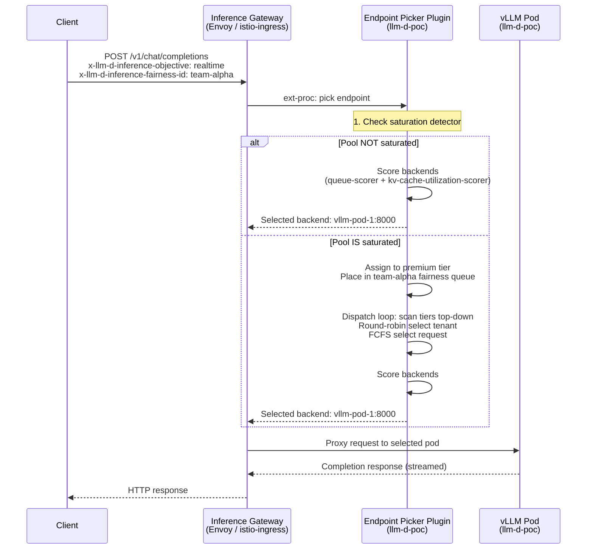
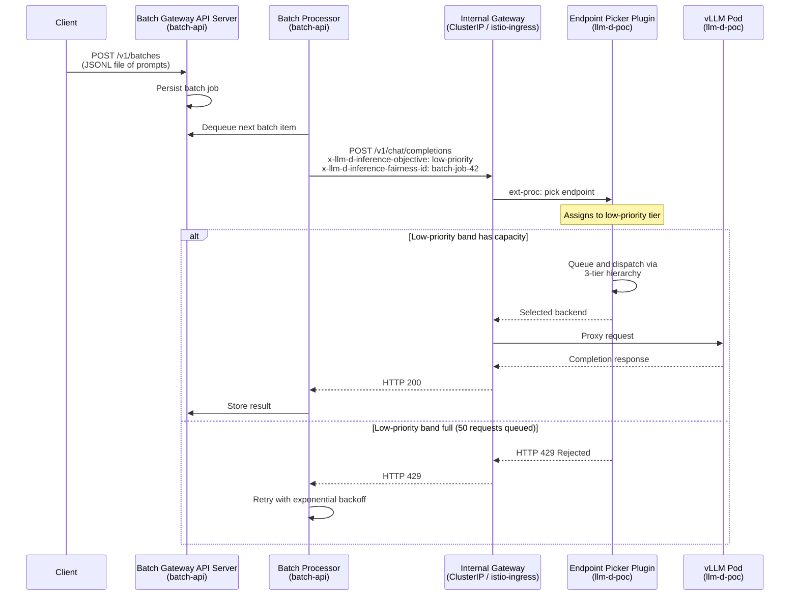
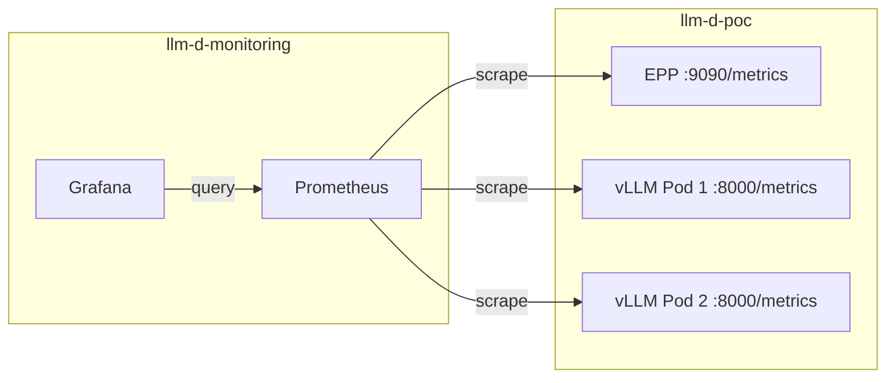
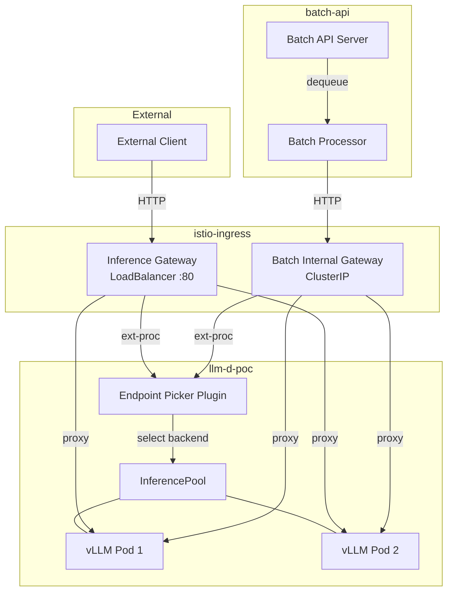

# Deployment Architecture

## Component Overview

| Component | Role | Namespace | Notes |
|-----------|------|-----------|-------|
| **Istio (istiod)** | Service mesh control plane with Gateway API Inference Extension support | `istio-system` | Configured with `ENABLE_GATEWAY_API_INFERENCE_EXTENSION=true` |
| **Gateway API CRDs** | Kubernetes API extensions for gateway routing (Gateway, HTTPRoute, InferencePool, InferenceObjective) | Cluster-scoped | Installed from the Kubernetes Gateway API release |
| **cert-manager** | TLS certificate management for webhooks and internal communication | `cert-manager` | Required by the llm-d router Helm chart |
| **Inference Gateway** | Envoy-based gateway that receives external client traffic and applies HTTPRoute rules | `istio-ingress` | Kubernetes `Gateway` resource; exposes port 80 via LoadBalancer |
| **Batch Internal Gateway** | ClusterIP gateway for batch processor traffic; not exposed externally | `istio-ingress` | Prevents batch traffic from consuming external gateway capacity |
| **Endpoint Picker Plugin (EPP)** | The flow control and scheduling brain; receives requests via ext-proc, manages priority queues, scores backends, dispatches | `llm-d-poc` | Runs as a Deployment; configured via `EndpointPickerConfig` in Helm values |
| **InferencePool** | CRD that groups vLLM pods into a routable pool; references the EPP as the endpoint picker | `llm-d-poc` | `failureMode: FailOpen` keeps traffic flowing if the EPP is unavailable |
| **InferenceObjective** | CRDs that map objective names to integer priorities (premium tier: `realtime`=100, standard tier: `standard`=0, low-priority tier: `low-priority`=-1) | `llm-d-poc` | Clients reference these by name via `x-llm-d-inference-objective` header |
| **vLLM** | Model serving engine running `nvidia/NVIDIA-Nemotron-Nano-9B-v2`; exposes OpenAI-compatible API on port 8000 | `llm-d-poc` | 2 replicas on `g5.xlarge` GPU nodes (NVIDIA A10G) |
| **Prometheus** | Metrics collection; scrapes EPP (port 9090) and vLLM (port 8000/metrics) | `llm-d-monitoring` | |
| **Grafana** | Dashboard visualization for latency, throughput, queue depth, and saturation metrics | `llm-d-monitoring` | Default admin password set in `config.env` |

## Request Flow

### Interactive Request

An interactive request (chat completion, single API call) follows this path
through the system:

Step by step:

1. **Client sends request.** The request includes the model endpoint path
   (`/v1/chat/completions`) and optionally the two flow control headers:
   `x-llm-d-inference-objective` and `x-llm-d-inference-fairness-id`.

2. **Gateway receives request.** The Envoy-based inference gateway in
   `istio-ingress` matches the request against the HTTPRoute (which has a 300s
   request timeout) and invokes the EPP via the external processing (ext-proc)
   gRPC protocol.

3. **EPP evaluates saturation.** The EPP queries the concurrency detector. If
   total in-flight requests across all vLLM pods are below `maxConcurrency`
   (15), the pool is not saturated.

4. **Unsaturated path.** The EPP scores all available backends using the
   scheduling profile (queue-scorer weight 2, kv-cache-utilization-scorer
   weight 2) and returns the best-scoring pod to the gateway. No queuing occurs.

5. **Saturated path.** The EPP reads the `x-llm-d-inference-objective` header,
   resolves it to the matching InferenceObjective CRD, and assigns the request
   to the corresponding tier. The request enters the fairness queue
   identified by `x-llm-d-inference-fairness-id`. The dispatch loop selects
   the next request to send using the 3-tier hierarchy (priority, fairness,
   ordering) and scores backends for the winner.

6. **Gateway proxies request.** The gateway forwards the request to the vLLM
   pod selected by the EPP.

7. **vLLM generates response.** The vLLM pod runs inference and streams the
   completion back through the gateway to the client.

## Batch Request Flow

Batch requests take a different entry path. Instead of arriving through the
external gateway, they are submitted to a batch API server that manages job
lifecycle, then routed through a dedicated internal gateway.

Step by step:

1. **Client submits batch.** A client sends a JSONL file of prompts to the
   batch API server (`POST /v1/batches`). The batch API server persists the job
   and its individual items.

2. **Processor dequeues items.** The batch processor pulls items from the job
   queue one at a time (or in small batches). For each item, it constructs a
   standard chat completion request.

3. **Processor sets headers.** The processor attaches
   `x-llm-d-inference-objective: low-priority` (mapping to priority -1) and
   a fairness ID that identifies the batch job.

4. **Internal gateway routes request.** The request is sent to the internal
   gateway (`batch-internal-gateway`), a ClusterIP service that is not exposed
   outside the cluster. This gateway applies the same HTTPRoute and invokes the
   EPP via ext-proc.

5. **EPP queues at low priority.** The EPP assigns the request to the
   low-priority tier. If the tier already holds 50 requests (its
   `maxRequests` limit), the request is rejected immediately with HTTP 429.

6. **Dispatch or shed.** If the request is admitted to the queue, it waits for
   higher-priority tiers to drain. The dispatch loop only reaches the low-priority tier
   when no premium or standard requests are waiting. If the request
   waits longer than the 60-second TTL, it is expired from the queue.

7. **Processor handles rejection.** On a 429 or timeout, the processor retries
   the item with exponential backoff. Batch throughput self-regulates around
   available capacity.

## Observability

### Metrics Collection

Two sources of metrics feed the observability stack:

| Source | Endpoint | Key Metrics |
|--------|----------|-------------|
| **EPP** | `:9090/metrics` | Request queue depth per tier, dispatch latency, saturation state, fairness distribution, shed/reject counts |
| **vLLM** | `:8000/metrics` | Token throughput (tokens/sec), time-to-first-token (TTFT), request latency (e2e and per-phase), KV-cache utilization, GPU memory usage, active sequences |

Prometheus runs in the `llm-d-monitoring` namespace and is configured to scrape
both endpoints. Service discovery uses Kubernetes pod labels to find EPP and
vLLM pods automatically.

### Grafana Dashboards

Grafana (also in `llm-d-monitoring`, port 3000) provides pre-built dashboards
for:

- **Pool health** -- Saturation state over time, total in-flight requests vs.
  `maxConcurrency` threshold.
- **Per-tier behavior** -- Queue depth per tier, dispatch rate per tier,
  time-in-queue distribution.
- **Fairness distribution** -- Per-tenant dispatch counts within each tier, showing whether round-robin is balancing correctly.
- **Model server performance** -- Per-pod token throughput, TTFT, KV-cache
  utilization, GPU memory pressure.
- **Batch processing** -- Shed rate, retry rate, effective throughput for batch
  jobs over time.

### Prometheus Scrape Architecture

## Network Topology

The deployment uses two distinct gateways to separate external and internal
traffic:

### External Gateway

The `llm-d-inference-gateway` is a Kubernetes `Gateway` resource in the
`istio-ingress` namespace. Istio provisions it as a LoadBalancer service
exposing port 80. All client-facing traffic (interactive chat, API calls) enters
through this gateway.

The gateway accepts routes from any namespace carrying the label
`llm-d.ai/gateway-route: "true"`. The `llm-d-poc` namespace has this label,
allowing the HTTPRoute in that namespace to attach to the gateway.

### Internal Gateway

The `batch-internal-gateway` is a ClusterIP service -- it has no external IP and
is only reachable from within the cluster. The batch processor in the
`batch-api` namespace sends requests to this gateway.

This separation ensures that:

- Batch traffic cannot consume external gateway capacity or connection limits.
- Network policies can restrict the internal gateway to only accept traffic from
  the `batch-api` namespace.
- The two traffic streams can be monitored and rate-limited independently at the
  gateway layer.

Both gateways route through the same EPP and the same InferencePool, so all
traffic -- regardless of entry point -- is subject to the same flow control
policies, tiers, and fairness rules.

---

## What to Read Next

- [Flow Control Primer](flow-control-primer.md) -- Conceptual deep-dive into
  the 3-tier dispatch hierarchy, headers, and saturation detection.
- [Platform Engineer Guide](platform-engineer-guide.md) -- Configuration
  deep-dive explaining why each EPP value was chosen and how to tune them.
- [Operator Guide](operator-guide.md) -- Dashboard tour, signal reading, and
  operational runbooks for managing a flow-controlled pool.
